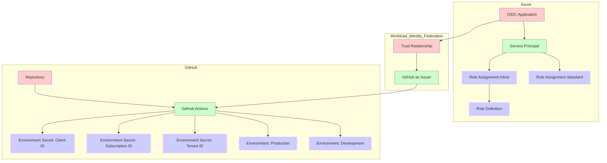

# Terraform Azure GitHub Actions Workload Identity Federation (WIF) - Basic Example

This example demonstrates the basic usage of the `terraform-azure-github-actions-wif` module to set up Workload Identity Federation for a GitHub Actions environment.

> **WARNIG:** Clean this example up from sensitive data before sharing it with others.

> **NOTE:** This example uses the `terraform-azure-github-actions-wif` module from the root of the repository. In a real-world scenario, you would use the module from the [Terraform Registry](https://registry.terraform.io/modules/telia-oss/terraform-azure-github-actions-wif).

## Usage

1. Run `terraform init` to initialize the Terraform working directory.
2. Run `terraform apply` to create the resources.
3. Verify the resources created by checking the output values.

## Inputs

No inputs.

## Outputs

| Name                                                                                                                                       | Description                                                                               |
| ------------------------------------------------------------------------------------------------------------------------------------------ | ----------------------------------------------------------------------------------------- |
|  [azure\_subscription\_id\_secrets](#output\_azure\_subscription\_id\_secrets)          | Information about the AZURE\_SUBSCRIPTION\_ID secrets for GitHub repository environments. |
|  [azure\_tenant\_id\_secrets](#output\_azure\_tenant\_id\_secrets)                            | Information about the AZURE\_TENANT\_ID secrets for GitHub repository environments.       |
|  [github\_oidc\_applications](#output\_github\_oidc\_applications)                           | Information about the created GitHub OIDC applications.                                   |
|  [github\_oidc\_applications\_secrets](#output\_github\_oidc\_applications\_secrets) | Information about the created GitHub OIDC applications secrets.                           |
|  [github\_oidc\_service\_principals](#output\_github\_oidc\_service\_principals)       | Information about the created GitHub OIDC service principals.                             |
|  [inline\_role\_definitions](#output\_inline\_role\_definitions)                              | Information about the inline role definitions.                                            |
|  [standard\_role\_assignments](#output\_standard\_role\_assignments)                        | Information about the standard role assignments.                                          |
